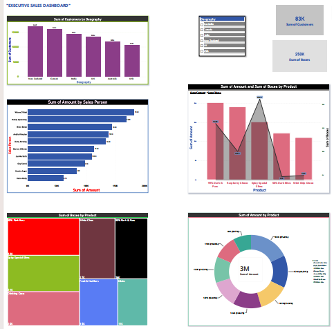

# 📊 Executive Sales Dashboard

An interactive Business Intelligence (BI) dashboard designed and developed to analyze comprehensive sales data, track key performance indicators (KPIs), and deliver actionable business insights.

---

### 🚀 Project Overview
This dashboard provides a centralized view of business performance, helping stakeholders evaluate regional sales trends, sales representative performance, and product-level profitability.

### 📈 Dashboard Preview & Visuals

  

  
  

### 🔑 Key Features & Metrics
* **KPI Summary Cards:** High-level overview displaying total customers and total sales/revenue metrics at a glance.
* **Geographical Analysis:** Visual breakdown mapping customer distribution across different regions and countries.
* **Salesperson Performance:** Ranked bar charts tracking the sales volume and contributions of individual sales representatives.
* **Product Analytics:** Combined bar and trend lines evaluating product sales versus bonuses, supported by detailed treemaps and donut charts for product distribution.

### 🛠️ Tech Stack & Tools
* **Platform:** Power BI (`.pbix`)
* **Core Skills:** Data Visualization, Business Intelligence, Data Analytics, Dashboard Designing
